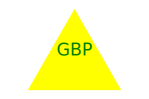

# Logo Generator

## Description

A logo generator created using inquirer and node js. Utilizes jest to test code. Command line application creates a logo by prompting the user to select a shape(circle, triangle, square or diamond), specify a color for the shape, enter up to 3 characters to appear within the selected shape, and select a color for the text. Application then produces an SVG file with the users input.

## Demo

https://github.com/AlexJ1890/Logo-Generator-10/assets/150198347/a00a908c-87cd-4441-a3f8-40b1ff896ccd

## Table of Contents

1. [Installation](#installation)
2. [Usage](#usage)
3. [License](#license)
4. [Contribution](#contribution)
5. [Testing](#testing)

## Installation

n/a

## Usage

n/a

## License

None

## Contribution

n/a

## Testing

npm install --save-dev jest\
 npm test

## Contact Me

Email me at [alexjhebert6@gmail.com](mailto:alexjhebert6@gmail.com) or check out my github @ [AlexJ1890](https://github.com/AlexJ1890)
